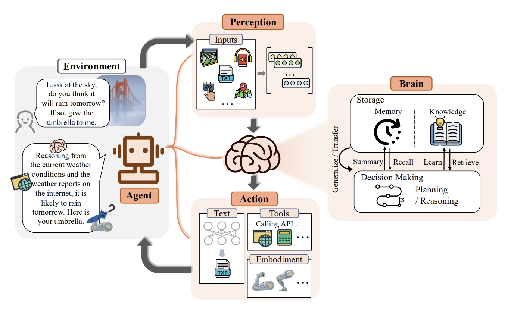
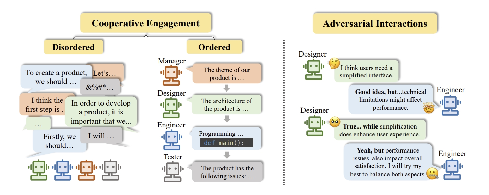
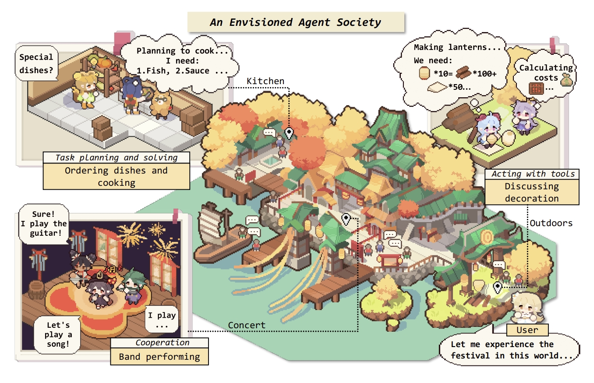

# Awesome-AI-Agents 🤖️

   

- [Awesome-AI-Agents 🤖️](#awesome-ai-agents-️)
  - [Applications](#applications)
    - [Autonomous Agent Task Solver Projects](#autonomous-agent-task-solver-projects)
    - [Multi-Agent Task Solver Projects](#multi-agent-task-solver-projects)
    - [Agent Society Simulation](#agent-society-simulation)
    - [Advanced Components](#advanced-components)
  - [Frameworks](#frameworks)
  - [Benchmark/Evaluator](#benchmarkevaluator)
  - [Platforms/API](#platformsapi)
  - [Related](#related)
    - [Survey](#survey)
    - [Paper-List Repo](#paper-list-repo)
    - [Blog](#blog)
  - [Reference Repo](#reference-repo)

## Applications

### Autonomous Agent Task Solver Projects

Open-source Large Language Model (LLM) driven autonomous agent that can automatically solve various tasks.

- [AutoGPT](https://github.com/Significant-Gravitas/AutoGPT) - AutoGPT is the vision of the power of AI accessible to everyone, to use and to build on. 
- [gpt-engineer](https://github.com/gpt-engineer-org/gpt-engineer) - Specify what you want it to build, the AI asks for clarification, and then builds it. 
- [gpt-researcher](https://github.com/assafelovic/gpt-researcher) - GPT based autonomous agent that does online comprehensive research on any given topic 
- [JARVIS](https://github.com/microsoft/JARVIS) - a system to connect LLMs with ML community. 
- [babyagi](https://github.com/yoheinakajima/babyagi) - An example of an AI-powered task management system. 
- [AgentGPT](https://github.com/reworkd/AgentGPT) - 🤖 Assemble, configure, and deploy autonomous AI Agents in your browser. 
- [OpenDevin](https://github.com/OpenDevin/OpenDevin) - a platform for autonomous software engineers, powered by AI and LLMs.  
- [XAgent](https://github.com/OpenBMB/XAgent) - An Autonomous LLM Agent for Complex Task Solving 
- [ShortGPT](https://github.com/RayVentura/ShortGPT) - 🚀🎬Experimental AI framework for automated short/video content creation. 
- [KwaiAgents](https://github.com/KwaiKEG/KwaiAgents) - A generalized information-seeking agent system with Large Language Models (LLMs). 
- [ProAgent](https://github.com/OpenBMB/ProAgent) - An LLM-based Agent for the New Automation Paradigm - Agentic Process Automation 
- [Agent-E](https://github.com/EmergenceAI/Agent-E) - Agent-E is an agent based system that aims to automate actions on the user's computer. At the moment it focuses on automation within the browser. The system is based on on AutoGen agent framework. 
- [Wordware](https://www.wordware.ai) - A web-hosted IDE where non-technical domain experts work with AI Engineers to build task-specific AI agents. It approaches prompting as a new programming language rather than low/no-code blocks.
- [GenAgent](https://github.com/xxyQwQ/GenAgent) - Build Collaborative AI Systems with Automated Workflow Generation - Case Studies on ComfyUI 
- [MLE-agent](https://github.com/MLSysOps/MLE-agent) - Your intelligent companion for seamless AI engineering and research. 🔍 Integrate with arxiv and paper with code to provide better code/research plans 🧰 OpenAI, Anthropic, Ollama, etc supported. 🎆 Code RAG 

### Multi-Agent Task Solver Projects

Open-source Large Language Model (LLM) driven Multi-Agent that can automatically solve various tasks.

- [MetaGPT](https://github.com/geekan/MetaGPT) - 🌟 The Multi-Agent Framework: Given one line Requirement, return PRD, Design, Tasks, Repo 
- [ChatDev](https://github.com/OpenBMB/ChatDev) - Create Customized Software using Natural Language Idea (through LLM-powered Multi-Agent Collaboration) 
- [DevOpsGPT](https://github.com/kuafuai/DevOpsGPT) - Multi agent system for AI-driven software development. 
- [Giselle](https://github.com/giselles-ai/giselle) - Giselle is an agentic workflow builder that empowers you to create AI-driven solutions with ease. 

### Agent Society Simulation

Exploring endless possibilities with open-source agent social simulation.

- [generative_agents](https://github.com/joonspk-research/generative_agents) - Interactive Simulacra of Human Behavior 
- [camel](https://github.com/camel-ai/camel) - 🐫 Communicative Agents for “Mind” Exploration of Large Language Model Society (NeruIPS'2023) 
- [ai-town](https://github.com/a16z-infra/ai-town) - deployable starter kit for building and customizing your own version of AI town - a virtual town where AI characters live, chat and socialize. 
- [GPTTeam](https://github.com/101dotxyz/GPTeam) - The main objective of this project is to explore the potential of GPT models in enhancing multi-agent productivity and effective communication. 
- [ChatArena](https://github.com/Farama-Foundation/chatarena) - ChatArena is a library that provides multi-agent language game environments and facilitates research about autonomous LLM agents and their social interactions. 
- [Camel-AutoGPT](https://github.com/SamurAIGPT/Camel-AutoGPT) - Watch two agents 🤝 collaborate and solve tasks together, unlocking endless possibilities in #ConversationalAI, 🎮 gaming, 📚 education, and more! 🔥 

### Advanced Components
- [mem0](https://github.com/mem0ai/mem0) - Mem0 provides a smart, self-improving memory layer for Large Language Models, enabling personalized AI experiences across applications. 
- [composio](https://github.com/ComposioHQ/composio) - Composio equips agents with well-crafted tools empowering them to tackle complex tasks 

## Frameworks

Quickly build and customize agents.

- [langchain](https://github.com/langchain-ai/langchain) - ⚡ Building applications with LLMs through composability ⚡ 
    - [awesome-langchain](https://github.com/kyrolabs/awesome-langchain) - 😎 Awesome list of tools and projects with the awesome LangChain framework 
- [llama_index](https://github.com/run-llama/llama_index) - LlamaIndex (formerly GPT Index) is a data framework for your LLM applications 
- [crewaAI](https://github.com/joaomdmoura/crewAI) - Framework for orchestrating role-playing, autonomous AI agents. By fostering collaborative intelligence, CrewAI empowers agents to work together seamlessly, tackling complex tasks. 
- [agents](https://github.com/aiwaves-cn/agents) - An Open-source Framework for Autonomous Language Agents 
- [AutoGen](https://github.com/microsoft/autogen) - AutoGen is a framework that enables the development of LLM applications using multiple agents that can converse with each other to solve tasks. 
- [TaskWeaver](https://github.com/microsoft/TaskWeaver) - A code-first agent framework for seamlessly planning and executing data analytics tasks. 
- [AgentVerse](https://github.com/OpenBMB/AgentVerse) - AgentVerse is designed to facilitate the deployment of multiple LLM-based agents in various applications. AgentVerse primarily provides two frameworks: task-solving and simulation. 
- [SuperAGI](https://github.com/TransformerOptimus/SuperAGI) - A dev-first open source autonomous AI agent framework. Enabling developers to build, manage & run useful autonomous agents quickly and reliably. 
- [AutoChain](https://github.com/Forethought-Technologies/AutoChain) - Build lightweight, extensible, and testable LLM Agents 
- [modelscope-agent](https://github.com/modelscope/modelscope-agent) - An agent framework connecting models in ModelScope with the world 
- [AppAgent](https://github.com/mnotgod96/AppAgent) - A novel LLM-based multimodal agent framework designed to operate smartphone applications. 
- [superagent](https://github.com/homanp/superagent) - 🥷 The open framework for building AI Assistants 
- [Voice Lab](https://github.com/saharmor/voice-lab) - A comprehensive testing and evaluation framework for voice agents across language models, prompts, and agent personas. 
- [AgentSquare](https://github.com/tsinghua-fib-lab/AgentSquare) - Automatic LLM Agent Search In Modular Design Space 
- [MixedVoices](https://github.com/MixedVoices/mixedvoices) - An Open source tool for analyzing and evaluating AI Voice agents. Track and visualize performance through call analysis and flow charts. Run complex simulations before pushing to production. 
- [KaibanJS](https://github.com/kaiban-ai/KaibanJS) - KaibanJS is a JavaScript-native framework for building and managing multi-agent systems with a Kanban-inspired approach. 
- [Upsonic](https://github.com/upsonic/upsonic) - Upsonic is a reliable agent framework supporting MCP, offering trusted agent workflows with verification layers. 

## Benchmark/Evaluator

Benchmarks to evaluate LLM-as-Agent across a variety of environments.

- [AgentBench](https://github.com/THUDM/AgentBench) - A Comprehensive Benchmark to Evaluate LLMs as Agents 
- [agentops](https://github.com/AgentOps-AI/agentops) - Python SDK for agent monitoring, LLM cost tracking, benchmarking, and more. Integrates with most LLMs and agent frameworks like CrewAI, Langchain, and Autogen 
- [langtrace](https://github.com/Scale3-Labs/langtrace) - Langtrace 🔍 is an open-source, Open Telemetry based end-to-end observability tool for LLM applications, providing real-time tracing, evaluations and metrics for popular LLMs, LLM frameworks, vectorDBs and more.. Integrate using Typescript, Python. 
- [ToolBench](https://github.com/OpenBMB/ToolBench) - An open platform for training, serving, and evaluating large language model for tool learning. 
- [LLM-Agent-Benchmark-List](https://github.com/zhangxjohn/LLM-Agent-Benchmark-List) - A benchmark list for evaluation of large language models.
- [agbenchmark](https://pypi.org/project/agbenchmark/) - by AutoGPT

## Platforms/API

Able to connect LLM with the real world.

- [OpenAgents](https://github.com/xlang-ai/OpenAgents) - An Open Platform for Language Agents in the Wild 
- [OpenAGI](https://github.com/agiresearch/OpenAGI) - "May the Force be with LLM and Domain Experts." 
- [RestGPT](https://github.com/Yifan-Song793/RestGPT) - An LLM-based autonomous agent controlling real-world applications via RESTful APIs 
- [AGiXT](https://github.com/Josh-XT/AGiXT) - AGiXT is a dynamic AI Agent Automation Platform that seamlessly orchestrates instruction management and complex task execution across diverse AI providers. 
- [agentlego](https://github.com/InternLM/agentlego) - Enhance LLM agents with versatile tool APIs 
- [UFO](https://github.com/microsoft/UFO) - A UI-Focused Agent for Windows OS Interaction. 

## Related

### Survey

- [A Survey on Large Language Model based Autonomous Agents](https://github.com/Paitesanshi/LLM-Agent-Survey)  
- [The Rise and Potential of Large Language Model Based Agents: A Survey](https://github.com/WooooDyy/LLM-Agent-Paper-List)  

### Paper-List Repo

- [Awesome-Papers-Autonomous-Agent](https://github.com/lafmdp/Awesome-Papers-Autonomous-Agent) - A collection of recent papers on building autonomous agent. Two topics included: RL-based / LLM-based agents.
- [LLM-Agents-Papers](https://github.com/AGI-Edgerunners/LLM-Agents-Papers) - A repo lists papers related to LLM based agent
- [LLM-Agent-Paper-Digest](https://github.com/XueyangFeng/LLM-Agent-Paper-Digest) - papers related to LLM-agent that published on top conferences
- [awesome-language-agents](https://github.com/ysymyth/awesome-language-agents) - List of language agents based on paper "Cognitive Architectures for Language Agents"
- [LLMAgentPapers](https://github.com/zjunlp/LLMAgentPapers) - Must-read Papers on LLM Agents.

### Blog

- [LLM Powered Autonomous Agents](https://lilianweng.github.io/posts/2023-06-23-agent/) - Amazing blog by Lilian Weng (OpenAI), Jun 23, 2023.
- [从第一性原理看大模型Agent技术](https://mp.weixin.qq.com/s/PL-QjlvVugUfmRD4g0P-qQ)
- [基于大语言模型的AI Agents](https://www.breezedeus.com/article/ai-agent-part3)
- [ICLR'24 上大型语言模型代理的最新研究进展 | 代理评估重点](https://medium.com/@aminerscholar_39923/latest-research-advancements-on-large-language-model-agents-at-iclr24-agent-evaluation-focus-aed420421365)

## Reference Repo

- [awesome-llm-powered-agent](https://github.com/hyp1231/awesome-llm-powered-agent) - Awesome things about LLM-powered agents. Papers / Repos / Blogs / ...
- [awesome-agents](https://github.com/kyrolabs/awesome-agents) - 🤖 Awesome list of AI Agents
- [awesome-ai-agents](https://github.com/e2b-dev/awesome-ai-agents) - A list of AI autonomous agents
- [awesome-ai-agents](https://github.com/slavakurilyak/awesome-ai-agents) - Awesome list of 100+ agentic AI resources
- [Best-AI-Agents](https://github.com/SamurAIGPT/Best-AI-Agents) - A list of top AI agents
- [ai-agent-roadmap](https://github.com/Yuan-ManX/ai-agent-roadmap) - Explore the latest AI Agent Framework!
- [Inspired projects by babyagi](https://github.com/yoheinakajima/babyagi/blob/main/docs/inspired-projects.md)
