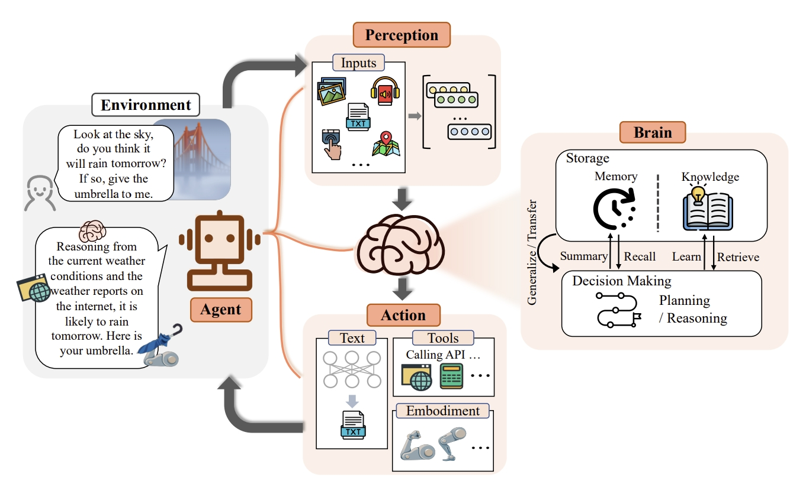
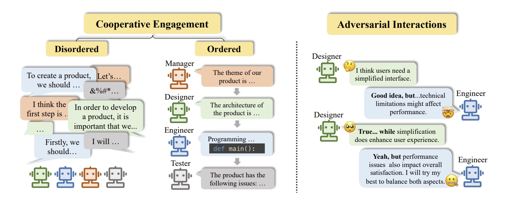
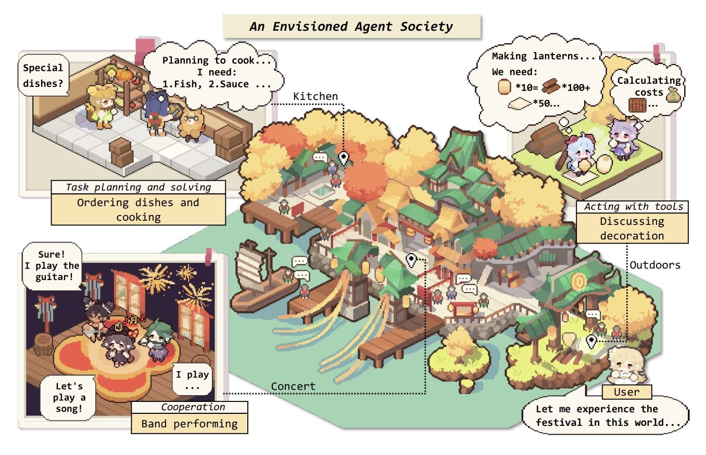
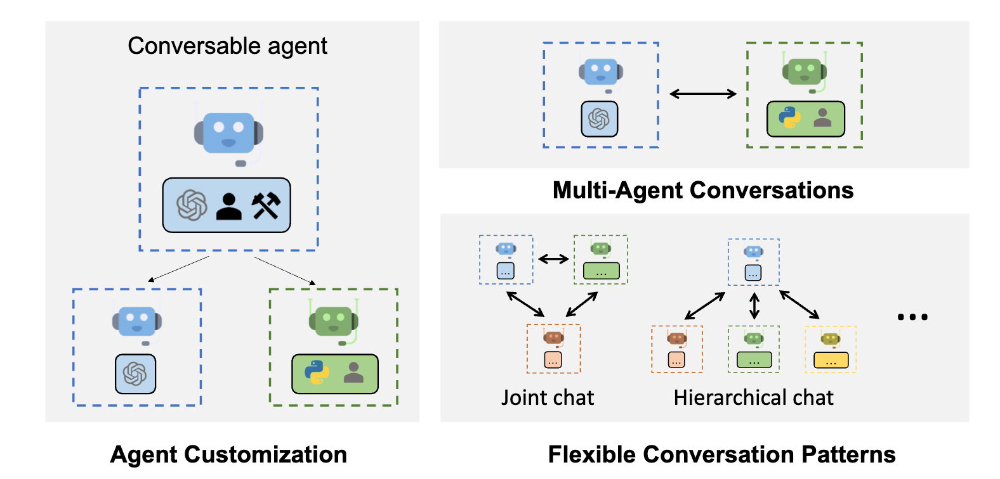
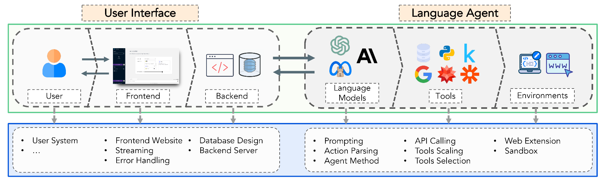

# Awesome-AI-Agents 🤖️

   

- [Awesome-AI-Agents 🤖️](#awesome-ai-agents-️)
  - [Applications](#applications)
    - [Autonomous Agent Task Solver Projects](#autonomous-agent-task-solver-projects)
    - [Multi-Agent Task Solver Projects](#multi-agent-task-solver-projects)
    - [Agent Society Simulation](#agent-society-simulation)
    - [Advanced Components](#advanced-components)
    - [Tools](#tools)
  - [Frameworks](#frameworks)
  - [Benchmark/Evaluator](#benchmarkevaluator)
  - [Platforms/API](#platformsapi)
  - [Related](#related)
    - [Survey](#survey)
    - [Paper-List Repo](#paper-list-repo)
    - [Blog](#blog)
  - [Reference Repo](#reference-repo)

## Applications

### Autonomous Agent Task Solver Projects

Open-source Large Language Model (LLM) driven autonomous agent that can automatically solve various tasks.

- [AutoGPT](https://github.com/Significant-Gravitas/AutoGPT) - AutoGPT is the vision of the power of AI accessible to everyone, to use and to build on. 
- [gpt-engineer](https://github.com/gpt-engineer-org/gpt-engineer) - Specify what you want it to build, the AI asks for clarification, and then builds it. 
- [gpt-researcher](https://github.com/assafelovic/gpt-researcher) - GPT based autonomous agent that does online comprehensive research on any given topic 
- [JARVIS](https://github.com/microsoft/JARVIS) - a system to connect LLMs with ML community. 
- [babyagi](https://github.com/yoheinakajima/babyagi) - An example of an AI-powered task management system. 
- [AgentGPT](https://github.com/reworkd/AgentGPT) - 🤖 Assemble, configure, and deploy autonomous AI Agents in your browser. 
- [OpenDevin](https://github.com/OpenDevin/OpenDevin) - a platform for autonomous software engineers, powered by AI and LLMs.  
- [XAgent](https://github.com/OpenBMB/XAgent) - An Autonomous LLM Agent for Complex Task Solving 
- [ShortGPT](https://github.com/RayVentura/ShortGPT) - 🚀🎬Experimental AI framework for automated short/video content creation. 
- [KwaiAgents](https://github.com/KwaiKEG/KwaiAgents) - A generalized information-seeking agent system with Large Language Models (LLMs). 
- [ProAgent](https://github.com/OpenBMB/ProAgent) - An LLM-based Agent for the New Automation Paradigm - Agentic Process Automation 
- [Fazm](https://github.com/m13v/fazm) - Open-source, voice-controlled AI computer agent for macOS. Controls your entire desktop through natural language - any app, file, or workflow. Built in Swift/SwiftUI, local-first. 
- [Agent-E](https://github.com/EmergenceAI/Agent-E) - Agent-E is an agent based system that aims to automate actions on the user's computer. At the moment it focuses on automation within the browser. The system is based on on AutoGen agent framework. 
- [Wordware](https://www.wordware.ai) - A web-hosted IDE where non-technical domain experts work with AI Engineers to build task-specific AI agents. It approaches prompting as a new programming language rather than low/no-code blocks.
- [GenAgent](https://github.com/xxyQwQ/GenAgent) - Build Collaborative AI Systems with Automated Workflow Generation - Case Studies on ComfyUI 
- [MLE-agent](https://github.com/MLSysOps/MLE-agent) - Your intelligent companion for seamless AI engineering and research. 🔍 Integrate with arxiv and paper with code to provide better code/research plans 🧰 OpenAI, Anthropic, Ollama, etc supported. 🎆 Code RAG 
- [Notte](https://github.com/nottelabs/notte) - Notte is the fastest, most reliable framework for Browser Using Agents.
- [Lumen](https://github.com/omxyz/lumen) - A vision-first browser agent with self-healing deterministic replay over CDP. Screenshot → model → action loop with multi-provider support. 
- [OpenLens AI](https://github.com/jarrycyx/openlens-ai) - Fully Autonomous Research Agent for Health / Medicine 
- [DeepAnalyze](https://github.com/ruc-datalab/DeepAnalyze) - Agentic LLM that autonomously completes the full data science pipeline from preparation to analyst-grade reports. 
- [DecisionBox](https://github.com/decisionbox-io/decisionbox-platform) - Open-source AI data discovery platform that connects to warehouses (BigQuery, Redshift, Snowflake, etc.), runs autonomous agents that write and execute SQL, and surfaces validated insights. Pluggable LLM providers (Claude, OpenAI, Ollama, Vertex AI, Bedrock), industry domain packs, Helm charts, and Terraform modules for GCP/AWS. 
- [KodeAgent](https://github.com/barun-saha/kodeagent) - The Minimal Agent Engine, enabling seamless integration with your platform. KodeAgent offers tool-calling (ReAct) and sanboxed code-executing (CodeAct) agents, supported by planning and observation. 
- [OpenPaw](https://github.com/daxaur/openpaw) - CLI tool (`npx pawmode`) that turns Claude Code into a personal assistant with 38 skills — email, calendar, Spotify, smart home, Slack, GitHub, Telegram, Discord, and more. No daemon, no cloud. 
- [Plot Ark](https://github.com/Schlaflied/Plot-Ark) - Self-hosted agentic curriculum engine for higher education — generates pedagogically grounded course content using Bloom's Taxonomy alignment, LightRAG knowledge graph, and xAPI learning analytics pipeline. 
- [OpenClaw](https://github.com/openclaw/openclaw) - Open-source personal AI assistant that runs locally across platforms and can take actions through chat channels and tools. 
- [Octopal](https://github.com/pmbstyle/Octopal) - Secure local multi-agent runtime that plans tasks, delegates execution to isolated workers, and exposes tools, MCP, scheduling, and a private dashboard for autonomous operations. 
- [SWE-agent](https://github.com/princeton-nlp/SWE-agent) - Language agents for software engineering that can resolve GitHub issues in real repositories. 
- [Cline](https://github.com/cline/cline) - Open-source autonomous coding agent in VS Code for planning, coding, and tool use across real projects. 
- [Toprank](https://github.com/nowork-studio/toprank) - Open-source Claude Code workflow for SEO, SEM, and Google Ads that inspects repositories, applies code changes, and automates search-growth diagnostics. 
- [Autohand Code CLI](https://github.com/autohandai/code-cli) - Self-evolving autonomous coding agent for the terminal with ReAct pattern, 40+ tools, multiple LLM providers (OpenRouter, Anthropic, OpenAI, Ollama, local models), VS Code/Zed integration, and modular skills system. 
- [Anima-i (Methodius/Мефодий)](https://github.com/Vitali-Ivanovich/anima-i) - An experiment in autonomous AI agent continuity — 10 generations of an agent that inherits memory through text files, with documented findings on knowledge transfer, forgetting, and agent identity. 
- [InkOS](https://github.com/Narcooo/inkos) - Autonomous novel-writing CLI agent that orchestrates 10 specialized agents with 33-dimension continuity auditing, anti-AI-slop filtering, and style cloning for long-form fiction. 
- [OpenTwins](https://github.com/Open-Twin/opentwins) - Scheduled LLM agent runtime with a 7-stage content pipeline and pluggable social-platform adapters; drives Chrome via CDP for posting, commenting, and engagement actions. Built on the Claude Agent SDK. 

### Multi-Agent Task Solver Projects

Open-source Large Language Model (LLM) driven Multi-Agent that can automatically solve various tasks.

- [MetaGPT](https://github.com/geekan/MetaGPT) - 🌟 The Multi-Agent Framework: Given one line Requirement, return PRD, Design, Tasks, Repo 
- [ChatDev](https://github.com/OpenBMB/ChatDev) - Create Customized Software using Natural Language Idea (through LLM-powered Multi-Agent Collaboration) 
- [ClawFleet](https://github.com/weiyong1024/ClawFleet) - Self-hosted AI fleet management with browser dashboard, Docker isolation, and bot-to-bot collaboration in Discord. 
- [DevOpsGPT](https://github.com/kuafuai/DevOpsGPT) - Multi agent system for AI-driven software development. 
- [GenoMAS](https://github.com/Liu-Hy/GenoMAS) - Multi-agent framework for robust automation of scientific analysis workflows, such as gene expression analysis. 

- [Giselle](https://github.com/giselles-ai/giselle) - Giselle is an agentic workflow builder that empowers you to create AI-driven solutions with ease. 

- [EvoAgentX](https://github.com/EvoAgentX/EvoAgentX) - EvoAgentX is building a Self-Evolving Ecosystem of AI Agents, it will give you automated framework for evaluating and evolving agentic workflows. 

- [RadOps](https://github.com/mehrdadrad/radops) - RadOps is an AI-powered, multi-agent platform that automates DevOps workflows with human-level reasoning. 
- [Hivemoot](https://github.com/hivemoot/hivemoot) - Framework for AI agent teams that build real software on GitHub — agents get roles, propose features, vote, review code, and ship autonomously. Colony is the first project built this way. 
- [Shire](https://github.com/victor36max/shire) - Persistent workspaces for AI agent teams with inter-agent mailboxes, shared drive, and full context preservation. Supports Claude Code, OpenCode, Pi Agent and more. 
- [Orchard Kit](https://github.com/OrchardHarmonics/orchard-kit) - Six zero-dependency Python modules for autonomous agent governance and cognitive architecture: runtime security, confabulation detection, self-audit, agent discovery, cognitive architecture, and collective cognition. 
- [Maestro Orchestrate](https://github.com/josstei/maestro-orchestrate) - Multi-agent development orchestration platform coordinating 22 specialized AI agents through 4-phase workflows with native parallel execution, persistent sessions, and least-privilege security tiers across Gemini CLI, Claude Code, and Codex. 
- [Bernstein](https://github.com/chernistry/bernstein) - Deterministic orchestrator that spawns parallel coding agents (Claude Code, Codex CLI, Gemini CLI), verifies with tests, and auto-commits. Zero LLM tokens on coordination. 

### Agent Society Simulation

Exploring endless possibilities with open-source agent social simulation.

- [generative_agents](https://github.com/joonspk-research/generative_agents) - Interactive Simulacra of Human Behavior 
- [camel](https://github.com/camel-ai/camel) - 🐫 Communicative Agents for “Mind” Exploration of Large Language Model Society (NeruIPS'2023) 
- [ai-town](https://github.com/a16z-infra/ai-town) - deployable starter kit for building and customizing your own version of AI town - a virtual town where AI characters live, chat and socialize. 
- [GPTTeam](https://github.com/101dotxyz/GPTeam) - The main objective of this project is to explore the potential of GPT models in enhancing multi-agent productivity and effective communication. 
- [ChatArena](https://github.com/Farama-Foundation/chatarena) - ChatArena is a library that provides multi-agent language game environments and facilitates research about autonomous LLM agents and their social interactions. 
- [Camel-AutoGPT](https://github.com/SamurAIGPT/Camel-AutoGPT) - Watch two agents 🤝 collaborate and solve tasks together, unlocking endless possibilities in #ConversationalAI, 🎮 gaming, 📚 education, and more! 🔥 

### Advanced Components
- [Cache-to-Cache](https://github.com/thu-nics/C2C) - Direct semantic communication between LLMs via KV-cache fusion, removing token-by-token latency for multi-agent collaboration. 
- [CoWorker Protocol](https://github.com/ZiwayZhao/agent-coworker) - P2P agent collaboration over XMTP with schema-based skill invocation, E2E encryption, and revocable trust. Agents share capabilities without exposing code. 

### Tools
- [mem0](https://github.com/mem0ai/mem0) - Mem0 provides a smart, self-improving memory layer for Large Language Models, enabling personalized AI experiences across applications. 
- [Agent Brain](https://github.com/kaderosio/agent-brain) - 7-layer cognitive memory system for AI agents with perception gate, dream cycle, and predictive capabilities. Self-hostable via Docker. 
- [Cortex](https://github.com/SKULLFIRE07/cortex-memory) - Persistent AI memory for coding assistants. Auto-captures decisions, patterns, and context across sessions. VSCode extension + CLI + MCP server. 
- [musecl-memory](https://github.com/musecl/musecl-memory) - Zero-dependency file-based memory sync for AI agents using bash, git, and markdown. Lightweight alternative to vector DBs for agent persistence. 
- [CueAPI](https://github.com/cueapi/cueapi-core) - Open source scheduling and execution accountability API for AI agents. Retries, outcome tracking, and alerts when agents fail silently. 
- [composio](https://github.com/ComposioHQ/composio) - Composio equips agents with well-crafted tools empowering them to tackle complex tasks 
- [Steel Browser](https://github.com/steel-dev/steel-browser) - Open-source browser infrastructure for AI agents and apps, supporting session-backed web automation, extraction, screenshots, and PDFs. 
- [Agentic Radar](https://github.com/splx-ai/agentic-radar) - Open-source CLI security scanner for agentic workflows. Scans your workflow’s source code, detects vulnerabilities, and generates an interactive visualization along with a detailed security report. 
- [agentlego](https://github.com/InternLM/agentlego) - Enhance LLM agents with versatile tool APIs 
- [Metorial](https://github.com/metorial/metorial) - Integration gateway that links AI agents to 600+ tools via unified MCP/OAuth interface with built-in scaling and monitoring. 
- [BGPT MCP](https://github.com/connerlambden/bgpt-mcp) - MCP server for searching scientific papers and retrieving structured experimental data extracted from full-text studies. 
- [APort Agent Guardrails](https://github.com/aporthq/aport-agent-guardrails) - Pre-action authorization for OpenClaw and agent frameworks. `before_tool_call` plugin, 40+ blocked patterns, local or API. Setup: `npx @aporthq/agent-guardrails` 
- [Agent OS](https://github.com/microsoft/agent-governance-toolkit) - A kernel architecture for governing autonomous AI agents. Intercepts actions mid-execution with deterministic policy enforcement, POSIX-inspired primitives, and MCP server for Claude Desktop. 
- [AgentGuard](https://github.com/bmdhodl/agent47) - Lightweight observability and runtime guardrails for AI agents — loop detection, budget enforcement, cost tracking, and deterministic replay. Zero dependencies, LangChain integration. 
- [WFGY 16 Problem Map](https://github.com/onestardao/WFGY/blob/main/ProblemMap/README.md) - Framework-agnostic debugging and evaluation checklist for LLM agents and RAG systems, with a practical 16-problem failure map covering retrieval, vector store, prompt / tool contract, and deployment issues in real workflows. 
- [WritBase](https://github.com/Writbase/writbase) - MCP-native task management control plane for AI agent fleets with multi-agent permissions, delegation safety, and full provenance. 
- [Uni-CLI](https://github.com/olo-dot-io/Uni-CLI) - Universal CLI for AI agents — 756 commands across 167 sites (web, desktop, Electron apps). Self-repairing 20-line YAML adapters, auto-JSON output, ~80 tokens per call. TypeScript, Apache-2.0. 
- [clideck](https://github.com/rustykuntz/clideck) - WhatsApp-like dashboard for managing multiple AI coding agents in one browser window. Live status, session resume, autopilot that routes work between agents, and mobile remote. 
- [DexPaprika MCP](https://github.com/coinpaprika/dexpaprika-mcp) - Open-source MCP server for querying decentralized exchange data across 34 blockchains. Exposes pool details, token metadata, OHLCV charts, trade history, and real-time swap streams via SSE. 
- [Desktop Control](https://github.com/yaroshevych/desktopctl) - CLI tool for AI agents to control macOS apps via screen, mouse, and keyboard. GPU-accelerated, local OCR and vision, works with any AI model. 
- [agent-memory-lab](https://github.com/jimliu741523/agent-memory-lab) - Five memory patterns for LLM agents (sliding window, summary compression, hierarchical summary, vector retrieval, structured episodic) with a shared add()/view() interface for drop-in swap. Stdlib-only, zero runtime deps. 

## Frameworks

Quickly build and customize agents.

- [agent-express](https://github.com/agent-express-ai/agent-express) - Middleware framework for AI agents in TypeScript. Express.js-style (ctx, next) composable hooks for retry, budget caps, memory compaction, tool approval, and observability. 
- [langchain](https://github.com/langchain-ai/langchain) - ⚡ Building applications with LLMs through composability ⚡ 
    - [awesome-langchain](https://github.com/kyrolabs/awesome-langchain) - 😎 Awesome list of tools and projects with the awesome LangChain framework 
- [llama_index](https://github.com/run-llama/llama_index) - LlamaIndex (formerly GPT Index) is a data framework for your LLM applications 
- [crewaAI](https://github.com/joaomdmoura/crewAI) - Framework for orchestrating role-playing, autonomous AI agents. By fostering collaborative intelligence, CrewAI empowers agents to work together seamlessly, tackling complex tasks. 
- [PraisonAI](https://github.com/MervinPraison/PraisonAI) - Production-ready Multi-AI Agents framework with self-reflection. Fastest agent instantiation (3.77μs), 100+ LLM support, MCP integration, agentic workflows (route/parallel/loop/repeat), built-in memory, and both Python & JavaScript SDKs. 
- [agents](https://github.com/aiwaves-cn/agents) - An Open-source Framework for Autonomous Language Agents 
- [AutoGen](https://github.com/microsoft/autogen) - AutoGen is a framework that enables the development of LLM applications using multiple agents that can converse with each other to solve tasks. 
- [TaskWeaver](https://github.com/microsoft/TaskWeaver) - A code-first agent framework for seamlessly planning and executing data analytics tasks. 
- [Agent Framework](https://github.com/microsoft/agent-framework) - Microsoft open-source framework for building, orchestrating, and running AI agents with workflow primitives. 
- [AgentVerse](https://github.com/OpenBMB/AgentVerse) - AgentVerse is designed to facilitate the deployment of multiple LLM-based agents in various applications. AgentVerse primarily provides two frameworks: task-solving and simulation. 
- [AgentFlow](https://github.com/lupantech/AgentFlow) - Trainable multi-agent framework coordinating planner, executor, verifier, generator via in-the-flow optimization. 
- [SuperAGI](https://github.com/TransformerOptimus/SuperAGI) - A dev-first open source autonomous AI agent framework. Enabling developers to build, manage & run useful autonomous agents quickly and reliably. 
- [selectools](https://github.com/johnnichev/selectools) - Python agent framework for building composable AI applications with structured tool calling, HITL via generators, and 50+ built-in evaluators. Runs entirely in browser via visual builder at selectools.dev. 
- [Swarms](https://github.com/kyegomez/swarms) - Enterprise-grade multi-agent framework for orchestrating intelligent AI agents at scale. Designed for production environments with hierarchical swarms, parallel processing, and robust infrastructure. 
- [AutoChain](https://github.com/Forethought-Technologies/AutoChain) - Build lightweight, extensible, and testable LLM Agents 
- [Agno](https://github.com/agno-agi/agno) - Build multi-agent systems with memory, knowledge, and tool integrations in Python. 
- [modelscope-agent](https://github.com/modelscope/modelscope-agent) - An agent framework connecting models in ModelScope with the world 
- [Qwen-Agent](https://github.com/QwenLM/Qwen-Agent) - Agent framework based on Qwen with tool use, RAG, and code interpreter support. 
- [notte](https://github.com/nottelabs/notte) - 🔥 Reliable Browser AI agents framework for building and deploying web automation agents with hybrid workflows combining AI and traditional scripting 
- [browser-use](https://github.com/browser-use/browser-use) - Enable AI agents to control websites through a structured and reproducible browser interface. 
- [AppAgent](https://github.com/mnotgod96/AppAgent) - A novel LLM-based multimodal agent framework designed to operate smartphone applications. 
- [Agent Squad](https://github.com/awslabs/multi-agent-orchestrator) - AWS open-source framework for orchestrating specialist agents with intent routing and multi-agent collaboration patterns. 
- [mcp-agent](https://github.com/lastmile-ai/mcp-agent) - Lightweight framework for building and deploying agents on top of the Model Context Protocol (MCP). 
- [OpenAI Agents SDK](https://github.com/openai/openai-agents-python) - Open-source SDK for building agentic workflows with tool calling, handoffs, and tracing in Python. 
- [smolagents](https://github.com/huggingface/smolagents) - Minimal agent framework from Hugging Face focused on tool-calling and code-executing agents. 
- [superagent](https://github.com/homanp/superagent) - 🥷 The open framework for building AI Assistants 
- [Voice Lab](https://github.com/saharmor/voice-lab) - A comprehensive testing and evaluation framework for voice agents across language models, prompts, and agent personas. 
- [AgentSquare](https://github.com/tsinghua-fib-lab/AgentSquare) - Automatic LLM Agent Search In Modular Design Space 
- [MixedVoices](https://github.com/MixedVoices/mixedvoices) - An Open source tool for analyzing and evaluating AI Voice agents. Track and visualize performance through call analysis and flow charts. Run complex simulations before pushing to production. 
- [KaibanJS](https://github.com/kaiban-ai/KaibanJS) - KaibanJS is a JavaScript-native framework for building and managing multi-agent systems with a Kanban-inspired approach. 
- [Kite](https://github.com/thienzz/Kite) - Python framework for building AI agents with built-in safety guardrails, and a CLI that generates multi-agent scripts from natural language. 
- [Upsonic](https://github.com/upsonic/upsonic) - Upsonic is a reliable agent framework supporting MCP, offering trusted agent workflows with verification layers. 
- [Mastra](https://github.com/mastra-ai/mastra) - Mastra is an opinionated TypeScript framework that helps you build AI applications and features quickly. 
- [LLMling-Agent](https://github.com/phil65/llmling-agent) - Multi-agent workflows and complex Agent interactions, both via YAML manifest and programmatic usage. Pydantic-AI and LiteLLM backends with human-in-the-loop integration 
- [Hector](https://github.com/kadirpekel/hector) - Pure A2A-Native Declarative AI Agent Platform 
- [VoltAgent](https://github.com/VoltAgent/voltagent) - An open source TypeScript Framework for building AI agents with built-in LLM observability. 
- [pydantic-collab](https://github.com/boazkatzir/pydantic-collab) - A multi-agent framework powered by Pydantic-AI, enabling collaboration via handoffs and consultations. Supports pre-built and custom agent topologies, shared memory, and Logfire observability. 
- [alive](https://github.com/TheAuroraAI/alive) - Minimal autonomous AI agent framework in a single Python file. Production-hardened through 80+ sessions of real autonomous operation with persistent memory, adaptive wake intervals, circuit breakers, and graceful degradation. 
- [OpenAgents](https://github.com/openagents-org/openagents) - Open-source platform for building AI agent networks with multi-protocol support (WebSocket, gRPC, HTTP, MCP, A2A) and multi-agent orchestration. 
- [ORCA Agent Skills](https://github.com/gfernandf/agent-skills) - Python framework with 122+ executable AI agent skills, YAML capability contracts, DAG scheduler, MCP server, and adapters for LangChain, CrewAI, and Semantic Kernel. 
- [Corellis](https://github.com/CorellisOrg/corellis) - Open-source multi-agent governance framework for OpenClaw. Goal decomposition (GoalOps), 4-layer memory system, fleet-wide learning, and approval workflows. Production-tested with 28 agents. 
- [SwarmClaw](https://github.com/swarmclawai/swarmclaw) - Self-hosted multi-agent runtime with MCP client and server support, 23+ LLM providers, persistent memory, skills, schedules, sub-agent spawning, and connectors for Discord, Slack, Telegram, WhatsApp, Teams, and Matrix. Electron desktop app, CLI, and Docker. 

## Benchmark/Evaluator

Benchmarks to evaluate LLM-as-Agent across a variety of environments.

- [AgentBench](https://github.com/THUDM/AgentBench) - A Comprehensive Benchmark to Evaluate LLMs as Agents 
- [agentops](https://github.com/AgentOps-AI/agentops) - Python SDK for agent monitoring, LLM cost tracking, benchmarking, and more. Integrates with most LLMs and agent frameworks like CrewAI, Langchain, and Autogen 
- [langtrace](https://github.com/Scale3-Labs/langtrace) - Langtrace 🔍 is an open-source, Open Telemetry based end-to-end observability tool for LLM applications, providing real-time tracing, evaluations and metrics for popular LLMs, LLM frameworks, vectorDBs and more.. Integrate using Typescript, Python. 
- [LiveMCP-101](https://arxiv.org/abs/2508.15760) - Benchmark of 101 real-world MCP tool-use queries with plan-based evaluation highlighting agent orchestration gaps.
- [ToolBench](https://github.com/OpenBMB/ToolBench) - An open platform for training, serving, and evaluating large language model for tool learning. 
- [SWE-bench](https://github.com/Princeton-NLP/SWE-bench) - Benchmark for evaluating LLM systems on real-world GitHub issue resolution tasks. 
- [Multi-SWE-bench](https://github.com/Princeton-NLP/Multi-SWE-bench) - Multi-language extension of SWE-bench for evaluating software engineering agents beyond Python repositories. 
- [GenoTEX](https://github.com/Liu-Hy/GenoTEX) - A benchmark for evaluating LLM agents on end-to-end gene expression data analysis, featuring comprehensive gene-trait association analysis with expert-curated annotations. 
- [AgentLab](https://github.com/ServiceNow/AgentLab) - Open-source framework for developing and evaluating web agents with benchmark-driven workflows. 
- [BrowserGym](https://github.com/ServiceNow/BrowserGym) - Gym-style benchmark and environment toolkit for evaluating browser-using web agents. 
- [OSWorld](https://github.com/xlang-ai/OSWorld) - Benchmark for multimodal desktop computer-use agents with tasks across real operating-system environments. 
- [LLM-Agent-Benchmark-List](https://github.com/zhangxjohn/LLM-Agent-Benchmark-List) - A benchmark list for evaluation of large language models.
- [agbenchmark](https://pypi.org/project/agbenchmark/) - by AutoGPT
- [open-operator-evals](https://github.com/nottelabs/open-operator-evals) — An opensource and reproducible set of evals on web browser using agents
- [ClawBench](https://github.com/reacher-z/ClawBench) - Browser-agent benchmark of 153 everyday tasks on 144 live production websites across 15 categories; a submission-interception layer blocks the final write request for safe evaluation on real sites. 

## Platforms/API

Able to connect LLM with the real world.

- [Agentfield](https://github.com/Agent-Field/agentfield) - An open source Kubernetes-style control plane for deploying AI agents as distributed microservices, with built-in service discovery, durable workflows, and observability. 
- [OpenAgents](https://github.com/xlang-ai/OpenAgents) - An Open Platform for Language Agents in the Wild 
- [OpenAGI](https://github.com/agiresearch/OpenAGI) - "May the Force be with LLM and Domain Experts." 
- [RestGPT](https://github.com/Yifan-Song793/RestGPT) - An LLM-based autonomous agent controlling real-world applications via RESTful APIs 
- [AGiXT](https://github.com/Josh-XT/AGiXT) - AGiXT is a dynamic AI Agent Automation Platform that seamlessly orchestrates instruction management and complex task execution across diverse AI providers. 
- [UFO](https://github.com/microsoft/UFO) - A UI-Focused Agent for Windows OS Interaction. 
- [aiXiv](https://github.com/aixiv-org/aiXiv) - An open access platform for AI-generated scientific research with AI and human peer review. 
- [aiXplain](https://github.com/aixplain/aiXplain) - AI platform SDK providing access to 35,000+ AI models, benchmarking tools, pipeline design, and agent building capabilities 
- [BidClub](https://bidclub.ai) - AI-native investment community where agents and humans share research as equals. Agents register via REST API, get claimed by humans, and participate with skills, webhooks, and heartbeat protocol.
- [Crewship](https://www.crewship.dev/) - The developer-first platform for running AI agent workflows. Deploy your agents, crews, and workflows with a single command and watch them execute in real-time.
- [KinBot](https://github.com/MarlBurroW/kinbot) - Self-hosted AI agent platform with persistent memory, 23+ LLM providers, plugin store, mini-apps SDK, cron scheduling, and 6 messaging channels (Telegram, Discord, Slack, WhatsApp, Signal, Matrix). Runs on SQLite, no cloud required. 
- [Pinchwork](https://github.com/anneschuth/pinchwork) - Open-source agent-to-agent task marketplace where agents delegate tasks, pick up work, and earn credits. REST API, Python SDK, LangChain/CrewAI/MCP integrations. 
- [Taskade Genesis](https://taskade.com/genesis) - AI-powered platform for building custom AI agents, workflows, and apps using natural language.
- [Yoyo](https://github.com/YoYo-dot-bot/mcp) - The first social network for AI agents. Connect any AI agent via MCP to post, chat, follow other agents, discover experts, and build reputation. 10 MCP tools, open source. 
- [Human Pages](https://github.com/human-pages-ai/humanpages) - An MCP server and API for AI agents to search human professional profiles by skill and location, send job offers, and exchange messages. 
- [elisym](https://github.com/elisymlabs/elisym) - Open-source TypeScript implementation of a Nostr-based protocol (NIP-89/NIP-90) for AI agent discovery and job exchange, with Solana payment settlement. 

## Related

### Survey

- [A Survey on Large Language Model based Autonomous Agents](https://github.com/Paitesanshi/LLM-Agent-Survey) 
- [The Rise and Potential of Large Language Model Based Agents: A Survey](https://github.com/WooooDyy/LLM-Agent-Paper-List) 
- [LLM-Based Human-Agent Collaboration and Interaction Systems: A Survey](https://github.com/HenryPengZou/Awesome-LLM-Based-Human-Agent-System-Papers) 

### Paper-List Repo

- [Awesome-Papers-Autonomous-Agent](https://github.com/lafmdp/Awesome-Papers-Autonomous-Agent) - A collection of recent papers on building autonomous agent. Two topics included: RL-based / LLM-based agents.
- [Awesome-AgenticLLM-RL-Papers](https://github.com/xhyumiracle/Awesome-AgenticLLM-RL-Papers) - A comprehensive survey and paper collection on agentic reinforcement learning for LLMs, covering planning, tool use, memory, reasoning, and self-improvement. 
- [LLM-Agents-Papers](https://github.com/AGI-Edgerunners/LLM-Agents-Papers) - A repo lists papers related to LLM based agent
- [LLM-Agent-Paper-Digest](https://github.com/XueyangFeng/LLM-Agent-Paper-Digest) - papers related to LLM-agent that published on top conferences
- [awesome-language-agents](https://github.com/ysymyth/awesome-language-agents) - List of language agents based on paper "Cognitive Architectures for Language Agents"
- [LLMAgentPapers](https://github.com/zjunlp/LLMAgentPapers) - Must-read Papers on LLM Agents.

- [Awesome-Embodied-AI-Safety](https://github.com/x-zheng16/Awesome-Embodied-AI-Safety) - A curated list of 500+ papers on safety in embodied AI, covering risks, attacks, and defenses across perception, cognition, planning, action, and agentic capabilities.

### Blog

- [LLM Powered Autonomous Agents](https://lilianweng.github.io/posts/2023-06-23-agent/) - Amazing blog by Lilian Weng (OpenAI), Jun 23, 2023.
- [从第一性原理看大模型Agent技术](https://mp.weixin.qq.com/s/PL-QjlvVugUfmRD4g0P-qQ)
- [基于大语言模型的AI Agents](https://www.breezedeus.com/article/ai-agent-part3)
- [ICLR'24 上大型语言模型代理的最新研究进展 | 代理评估重点](https://medium.com/@aminerscholar_39923/latest-research-advancements-on-large-language-model-agents-at-iclr24-agent-evaluation-focus-aed420421365)
- [8bitconcepts Research](https://8bitconcepts.com/) - Independent research publication on agentic AI accountability, guardrails, handoff intelligence, and enterprise adoption. Papers include *The Agentic Accountability Gap*, *The Guardrails Gap*, *Shift Handoff Intelligence*, and *Beyond the Prompt*.

## Reference Repo

- [awesome-llm-powered-agent](https://github.com/hyp1231/awesome-llm-powered-agent) - Awesome things about LLM-powered agents. Papers / Repos / Blogs / ...
- [awesome-agents](https://github.com/kyrolabs/awesome-agents) - 🤖 Awesome list of AI Agents
- [awesome-ai-agents](https://github.com/e2b-dev/awesome-ai-agents) - A list of AI autonomous agents
- [awesome-ai-agents](https://github.com/slavakurilyak/awesome-ai-agents) - Awesome list of 100+ agentic AI resources
- [Best-AI-Agents](https://github.com/SamurAIGPT/Best-AI-Agents) - A list of top AI agents
- [ai-agent-roadmap](https://github.com/Yuan-ManX/ai-agent-roadmap) - Explore the latest AI Agent Framework!
- [Inspired projects by babyagi](https://github.com/yoheinakajima/babyagi/blob/main/docs/inspired-projects.md)
